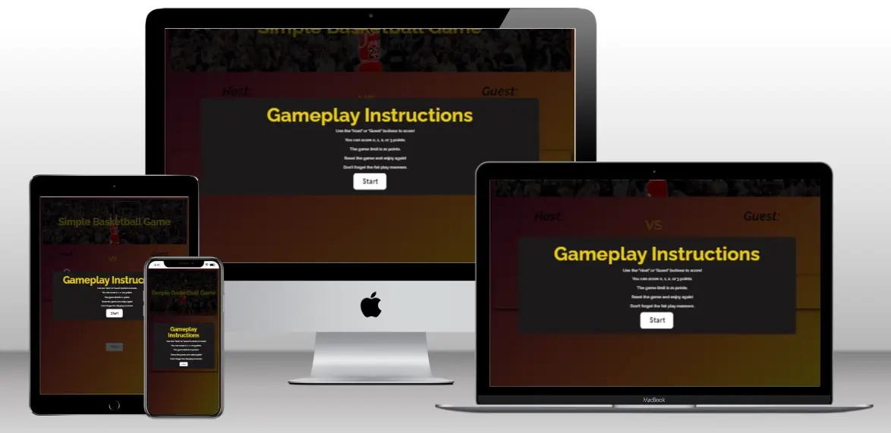
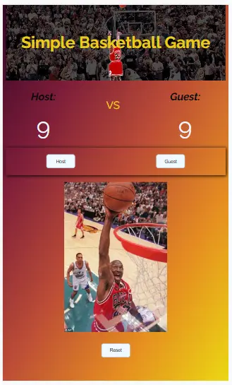
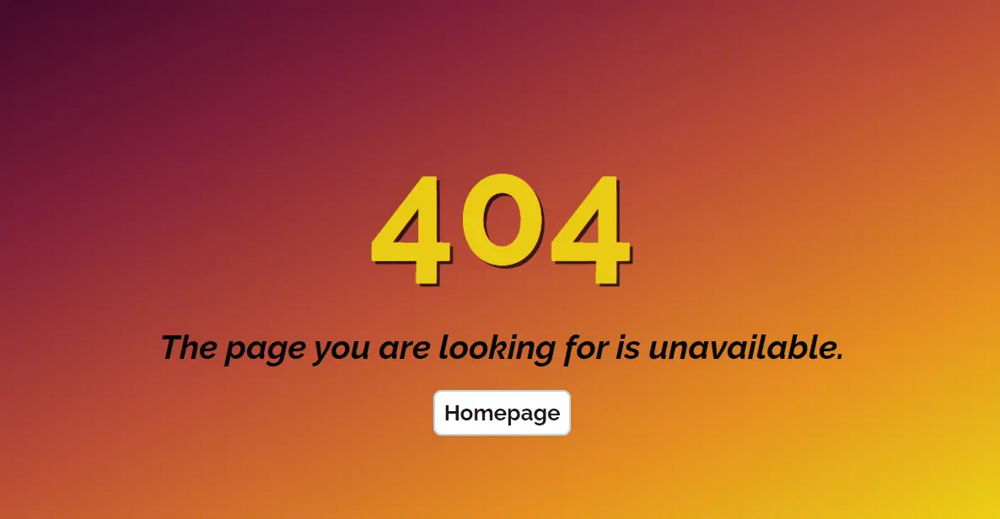
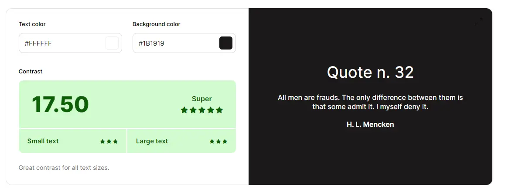
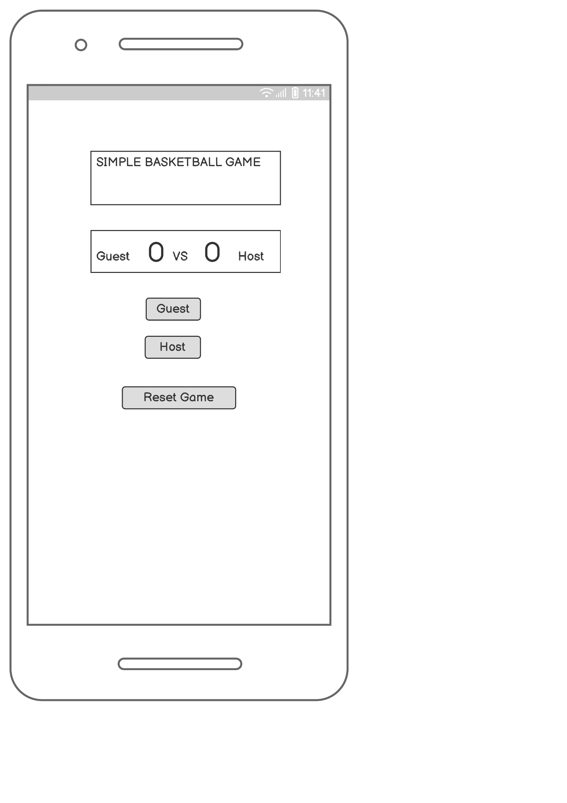
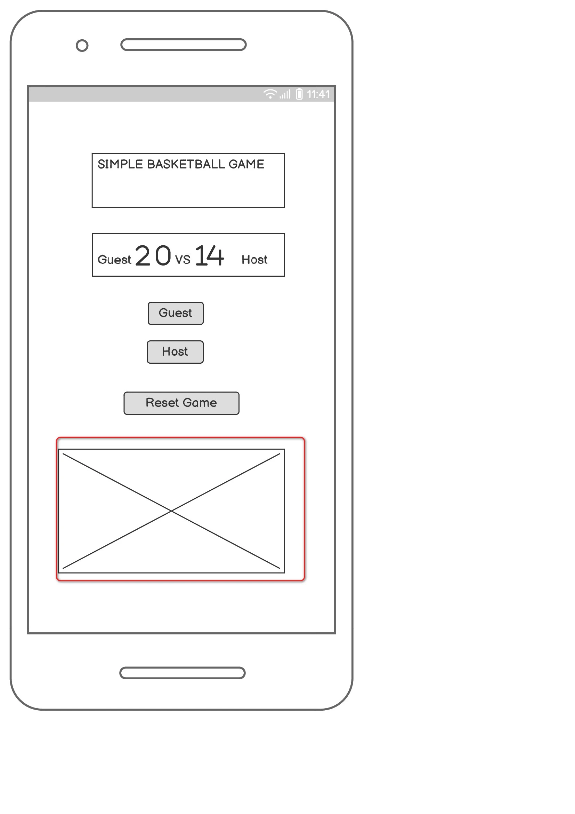
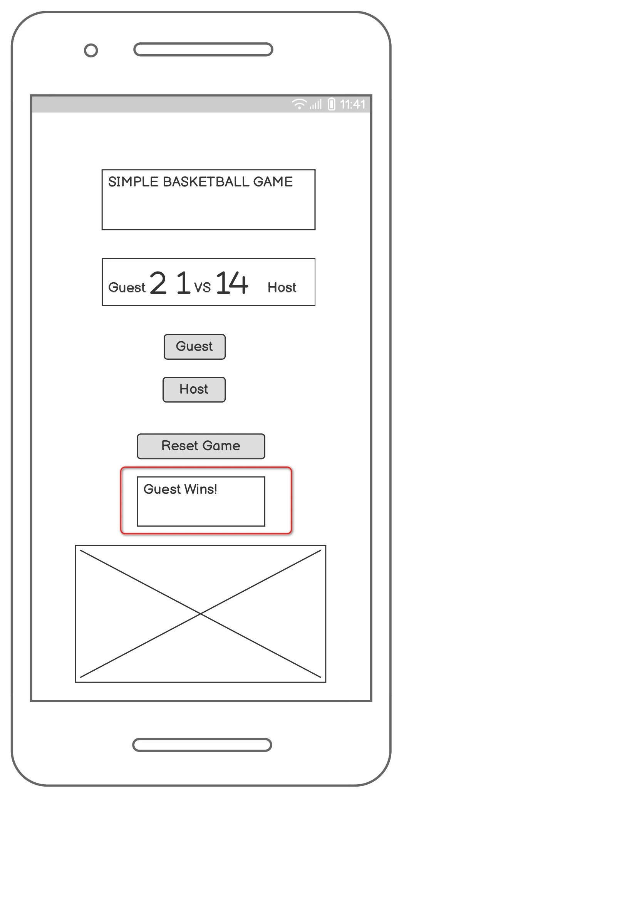
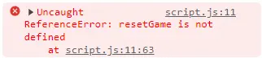

# Small Basketball Game

## User Experience (UX) Section

## Objective

The goal of this simple online game is to entertain users, especially those passionate about basketball. The game's objective: scoring 21 points.

## Users Benefits and Goals

#### A) For the first-time user

The game's objective is to score 21 points.
The website provides entertainment for both solo and duo players. Furthermore, novices can leverage the platform to grasp the foundational rules of basketball. A blend of text and visual elements enhances user engagement and evokes positive emotions.

#### For returning and frequent users

The game's appeal may lie in its quick completion time, catering perfectly to instances when players are pressed for time.

### Design

The **favicon** appears in the browser's address bar when visiting the site.

**Instruction Page**

Upon loading the page, the user is presented with the game's straightforward rules. They are displayed on a black overlay above the main site page. The game begins when the user clicks the **start button**.
The project consists of the **main** and **error** page
The **main page** captivates the user's interest with an inspiring image and a title in *the landing* section.

**Main Page**

The game boasts multiple **interactive elements**.
Notably, there are two main buttons: *'Host'* and *'Guest.'* These buttons allow players to earn 0, 1, 2, or 3 points with every click. The accumulated points are displayed in real-time on the **result board.** Additionally, based on the points scored, relevant **photos** are showcased beneath the gaming console. For example, scoring 3 points reveals an image of a player taking a shot from the 3-point line.
The appearance of photos is followed by an appropriate **soundtrack**.
The **conclusion of the game** is marked by a relevant photo announcing the winning team, host, or guest.
The **Reset Game** button is used to initiate a fresh start of the game.

**Error Page**

For website users, having a well-designed Error Page is essential. In keeping with design consistency, this page closely mirrors the aesthetic of the "Main Page". 
Users can conveniently navigate back to the Main Page using the **Homepage** button.

## Technologies, Software, and Learning Resources Used

- HTML, CSS, JavaScript
- [Multi-mockup-generator](https://techsini.com/multi-mockup/index.php "Multi-mockup-generator") to create the mockup for responsive pages.
- [Faststone Image Viewer](https://www.faststone.org/ "Faststone Image Viewer") was utilised for image resizing and photo editing.
- [Mycolor Space](https://mycolor.space/ "Mycolor Space") is used to create a background color gradient.
- [Box-Shadow CSS Generator](https://html-css-js.com/ "Box-Shadow CSS Generator") used to create box shadows.
- Favicon used courtesy of: <a href="https://www.flaticon.com/free-icons/sports-and-competition" title="sports and competition icons"> Freepik - Flaticon</a>
- [Audiotrimer](https://audiotrimmer.com/ "Audiotrimer") to reduce the length of the audio material
- Source for the audio files available in comments in the index.html file
- [Screenshot Generator](https://www.screenshotmachine.com/website-screenshot-generator.php> "Screenshot Generator")
-Mozilla Dev-Tool color picker
- Git Version control was managed using Git, with commits executed via the Gitpod terminal and pushes directed to GitHub.
- GitHub The project's code is stored on GitHub after being pushed from Git.
-Readibility controled by [coolors contrast checker](https://coolors.co/contrast-checker/112a46-acc8e5 "coolors contrast checker")

------------

- [CSS overflow-y Property](https://www.w3schools.com/cssref/css3_pr_overflow-y.php "CSS overflow-y Property")
-[www.w3schools]: <https://www.w3schools.com/jsref/prop_style_display.asp> for Style display Property
-[SheCodes](https://www.shecodes.io/athena/121718-how-to-use-transform-translate-50-50-to-center-an-element-in-css "SheCodes") for transform: translate(-50%, -50%) CSS code
-[flex-wrap](http://https://developer.mozilla.org/en-US/docs/Web/CSS/flex-wrap "flex-wrap") used as a learning source.
- [PX to REM conversion method](https://www.youtube.com/watch?v=crVDQf7T0d4&t=985s "PX to REM conversion method")
-[www.w3schools.com](https://www.w3schools.com/jsref/prop_pushbutton_disabled.asp "www.w3schools.com") for Button disabled Property
-[Audio Paused](https://www.w3schools.com/jsref/met_audio_pause.asp "Audio Paused") user for stopAllAudio function.

### Typography

[Google Fonts](https://fonts.google.com/” "Google Fonts") was used to link the "Raleway" font. These have been used on all pages throughout the project. Sans Serif is the fallback font.

## Deployment

- This web project is a part of [Code Institute](https://learn.codeinstitute.net/ci_program/diplomainfullstacksoftwarecommoncurriculum "Code Institute") learning activities.
- Author: Dr. Vladimir Aleksic
- Contact Details: vladimiraleksic.nis@gmail.com
- Licence: Creative Commons
  
The idea and resource code implemented into this product came from the following learning sources:

#### Code Institute

1. Writing Some HTML - part 2
	- buttons (cc 1:08 min)
	- span (cc 2:40 min)
	- correct answer (cc 4.00 min)
2. Let´s Get Some Stylish
	- submit (after 2:15 min)
3. Adding Structure
4. Creating Event Listners
	- Loading Page
	- Let (botton for buttons) (cc 2:54 min)
	- "If Button" (cc 4:40 min)
5. Generating Random Numbers
	- Built-in Functions - Working With Math
6. Displying the Addition Question
7. Calculating The Correct Answer (cc 4:10 min)
8. Updating the Scores (cc 2:10 min)

#### SuperSimpleDev

[JavaScript Full Course (2023) - Beginner to Pro - Part 1](https://www.youtube.com/watch?v=SBmSRK3feww&t=8348s "JavaScript Full Course (2023) - Beginner to Pro - Part 1")

- Chapters 6, 7 and further

Original wireframe design delivered by Balsamiq:

A significant departure from the initial design involves removing the "Guest Wins!" section, present in the Figure no. 3 and repositioning the "Host," "Guest," and "Reset Button" elements.
Menthor suggested the creation of the Instruction layer and introduction of a obvious responce, in this case audio, when clicking Host/Guest buttons

## Testing and debugging

- [W3C Markup Validator](https://validator.w3.org/ "W3C Markup Validator")
- [W3C CSS Validator](https://jigsaw.w3.org/css-validator/#validate_by_input "W3C CSS Validator")
- [Python Tutor](https://pythontutor.com/ "Python Tutor") used as a visual debugger for visually analyzing code step-by-step.
- [Jshint](<https://jshint.com/> "Jshint") used as a visual debugger and validator.
-Console reports indicate the missing parts of the code and determine the next coding steps.

## Testing User Stories from the UX Section

#### First-Time Visitor Goals

- As a first-time visitor, clarity and quick understanding are paramount. Right off the bat, the site welcomes users with clear and short instructions, making it easy to understand what to expect during further usage of the web product.
- Directly below, a clearly visible *start button* makes it easy for a smooth transition to the game level.

- At this level, seamless site usage is essential too. The website is designed with two-play buttons (*Host* and *Guest*), ensuring users can effortlessly enjoy the game.
- The same principle applies to the *Reset button*, which enables a new session to commence.
- by using CSS technology, all buttons stated above, as well as the “Homepage” button in the 404.html page interact with the user when hovered over.

#### Returning and Frequent Visitor Goals

For these two categories, the website offers a captivating experience which tempts them to use this product multiple times.

#### Observations on Smartphone Device Adaptability

- We identified a design constraint on smartphones when the device orientation is switched to landscape mode. In the initial design, it wasn't possible to see the “Score Board”, “Game Container”, and the associated images all at once.
- In our *updated design*, we've made modifications to the height of the “Game Container” and adjusted margins. This ensures a better view of all three sections. While this enhancement addresses the design and functionality challenges to some extent, it's a step forward, but not a complete resolution.

### Further Testing

-The Website was tested on Google Chrome and Firefox web browsers.
-The project was designed for the screen with the following width sizes: 320px 768px and 1024px.
-The website was viewed and responsiveness controlled on various devices of various screen sizes (smartphone, tablet, 1024px).
-Extensive testing was conducted to verify correct linking across all pages, including the 404.html page and Google Fonts URL.

### Known Bugs

### Acknowledgments

- Mentor Narender Singh
- Sarah, Roman, and Oisin from CI Tutor Team
